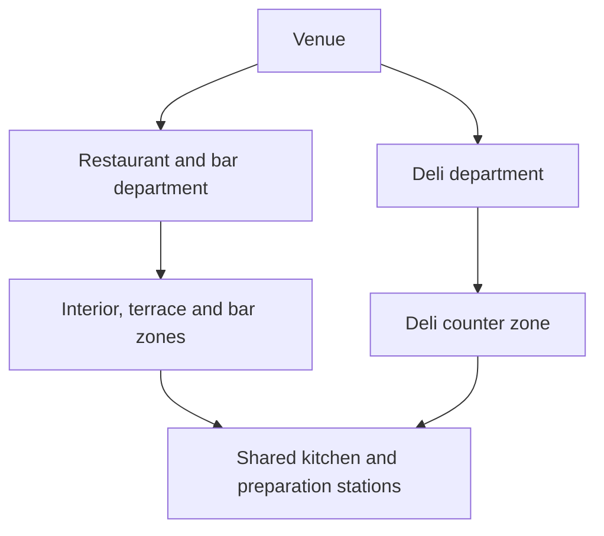

# Venue departments, menus and preparation routing

**Date:** 2026-09-09. **Status:** the owner approved the domain direction; the implementation
defaults below are proposed decisions for this plan, not separately approved behaviour.
**Implementation:** [execution plan](../plans/2026-09-09-venue-departments-and-menus.md).
**Inspection baseline:** `menus` at `67047fb3`. This note records source inspection, not a runtime
verification of the existing system. No implementation is included with these documents.

## 1. The operation you need to represent

You run a restaurant/bar and a takeaway deli at the same premises. They have different trading
names, public listings, menus, hours and staffing, but share a kitchen and some products. The
working assumption is that both sell under the same legal entity and tax identity. Confirm that
identity before production setup; Google Maps integration is outside this work.

Use one venue, containing two departments. A department is an operation you manage; a zone is
somewhere you serve customers. The restaurant department contains the interior, terrace and bar
zones. The deli department contains the deli counter. Preparation stations belong to the venue
and can serve every department.

## 2. Decisions from the conversation

| Concept | Agreed responsibility |
| --- | --- |
| Legal business | One seller and tax identity, assumed pending production confirmation. |
| Venue | One operational database replicated across a node group with one active primary. |
| Department | Trading identity, opening hours, staffing organisation and sales reporting. A single default department can stay invisible. |
| Zone | Service destination, allowed menus and one default menu; service style can vary by zone. Tables are optional. |
| Station | Preparation or fulfilment destination, shared across departments where needed. |
| Product | One identity, category, unit of sale, descriptions, recipe and allergen/diet information, independent of menus. |
| Menu | A selection of products, with its own prices and modifiers. Use Products and Menus in the interface, not Catalogue as a second name for Menu. |
| Menu item | One product offered on one menu. The same product can have different prices on different menus. |
| Routing | The service zone and product category select a station, with product exceptions. |
| Recipe | Composition for ingredients, allergen/diet derivation and later planning, costing and stock. |

One Negroni product can be served upstairs and downstairs. Category Cocktails ordered upstairs
routes to Upstairs bar; downstairs it routes to Downstairs bar. Different preparation locations
do not require duplicate products. Product stock and ingredient quantities remain future work.

Independent restaurants should eventually appear under shared cloud management, with a separate
operational database/node group per venue. Cross-venue templates, reporting and hosting are future
work. This change does not implement a cloud management service or independent venue primaries
inside one database.

## 3. Defaults selected for implementation

These choices make the approved direction executable. Change this section and its acceptance
examples if the owner chooses differently; do not silently invent another behaviour in code.

### Products, offers and choices

Keep `@waitron/catalogue` as the existing internal package name. Existing `catalogues` rows become
menu definitions in the product language; a mechanical package/table rename is unnecessary.
Remove product ownership by one catalogue and remove the product's selling price. A product has
one required category and the existing `each` or `weight` unit. Weight remains priced per kg;
displaying 100 g does not change the stored pricing basis. Zero-priced offers remain valid.

A menu item has a stable ID, product ID, menu ID, gross price, menu section, display order and
active flag. Initially one product appears at most once per menu. Distinct portions or recipes are
distinct products until explicit variants are designed. Product category is a stable management
classification; menu section is presentation; course is when a dish is served. Keep these separate.

Reusable option groups and their ingredient/allergen meaning remain product definitions. A menu
item explicitly selects from its product's attached groups and explicitly prices its offered
choices. Product option groups are eligibility, not automatic menu publication. A required group
must be included with a satisfiable active selection; optional groups may be omitted. Preserve
selection bounds, option quantities, tax inheritance and the existing allergen/diet overlays.
Removing a required choice must not silently create an orderable, impossible form.

The ordering wire sends `menuItemId`, quantities and selected option IDs. The server derives
product, menu, price and allowed choices from that ID and the order's zone. Never resolve an offer
by product ID alone or trust a client-supplied price. An order can combine several allowed menus,
including the same product at two different prices without collapsing those lines.

### Zone policy and order context

Each zone belongs to exactly one department. Its allowed menus are explicit assignments. Its
default is one of those assignments, and changing the default keeps the old menu allowed.
Configuration can be incomplete while you set up; selling requires an active zone, department,
default menu and valid offer. If the selected menu becomes unavailable, select the available
default, then the first allowed active menu in configured order, or show an explanatory empty state.

Service mode resolves from a zone override, then department default, then venue default. The
service contract distinguishes `table_tab` (the existing running tab, paid at close) from the
existing counter modes `prepay`, `invoice_first` and `ticket_then_pay`. This is a new service-mode
contract, not a silent change to the existing `order_flow` enum. Restaurant defaults to table tabs;
Deli defaults to prepay. Zone overrides allow a bar counter inside the restaurant department.
Department and zone names never select a mode implicitly. Counter delivery to a table requires a
counter-mode destination zone; normal table-tab zones use the tab flow. Refuse mismatches clearly.

A table order uses its table's zone. A counter order uses an explicitly selected zone, initially
the enrolled device's default. A delivery-to-table counter order uses the destination table's
zone. The server checks tenant and venue for every supplied ID. A handheld follows the selected
order; its physical position never determines routing. Opening an order freezes its effective
service mode, so another device, a settings edit or a table move cannot change how it must be paid.

Adding a line records its offer identity, menu/department/category labels and agreed monetary
values. Unchanged parked lines retain their locks even if the live offer changes or is deactivated.
Adding a new line uses current availability and prices. Editing an existing line's quantity retains
its unit-price lock; changing its product or modifiers replaces that selection at current prices,
with the resulting amount shown before submission. Keep line identities through draft updates.

Moving an order updates its service destination for future additions and unsent preparation, while
existing prices and selling-department attribution stay fixed. Fired preparation retains its
station; the destination label may update for delivery. Split/merge/transfer operations retain
each line's original offer, price and department. Merge/transfer between orders with different
frozen payment flows is refused with an explanatory error in this slice. Joined tables must share
a service zone, so an order has one unambiguous destination.

### Preparation

Resolve routing in this order: zone/product, zone/category, venue/product, venue/category.
An explicit `no_preparation` target terminates resolution. Absence means missing configuration;
it is not another spelling of no preparation. Rules have at most one target at each specificity.
A category-wide rule to a main kitchen makes initial configuration simple without an implicit
catch-all that hides missing routes.

Resolve and save the target when sending a line for preparation. Revalidate the station is active
in the venue within the same transaction. Missing or inactive targets produce a correctable local
configuration error before a newly placed counter order is filed or sent; existing issued orders
must still be settleable. Do not automatically route a closed bar's orders elsewhere. Manual rule
changes affect subsequent sends, never duplicate already fired work. Preserve idempotent fire,
course holding, recalls, modifiers and printer routing. A line explicitly requiring no preparation
does not keep an order waiting forever in a preparation/collection queue.

Kitchen screens and tickets identify department, destination and service context. Department,
zone and menu do not determine packaging implicitly: preserve modifier/note instructions. A
future packaging or fulfilment-mode feature should have its own explicit contract.

### Hours, staffing and reporting

Department opening hours support multiple local-time intervals per weekday, overnight intervals
and dated exceptions. Zones inherit them unless given an explicit replacement schedule. Inherit,
closed and not configured are distinct values. Use the venue timezone. These are trading hours
for display and planning in this slice, not automatic sale/booking rejection or menu scheduling.
Preparation shifts may start before opening or end afterwards.

Shifts and shift templates may name a department and/or preparation station, validated against
their venue. No department means shared venue work. Staff identities, employment and labour-rule
checks remain shared; overlaps are checked across departments. A shift swap changes the person,
not the shift's work assignment. Keep roster publication at venue level and add department filters;
separate departmental publication and shared-cost allocation are deferred.

Report sales by the department recorded on each sold line, including its modifier lines. A mixed
department bill is permitted when its order flows are compatible. Snapshot commercial attribution
at issuance in an append-only extension table; never rebuild historical totals from current zone
membership or product names. Reuse existing void, substitution, correction, timezone and business-day
rules. Unknown attribution on a standalone adjustment appears as Unallocated, not a guessed split.

### Provisioning and module boundaries

Keep the internal `locations` identifier for the venue. Enforce the one-venue operational rule at
provisioning/adoption/boot boundaries, including concurrent attempts, rather than introducing a
global SQL limit that prevents multi-tenant isolation fixtures. Re-running setup for the same venue
is allowed; requesting a different venue in the same operational database is refused before writes.
Keep existing tenant-scoped reads and foreign keys even with this deployment restriction.

New domain tables belong to modules:

| Owner | Tables/responsibilities |
| --- | --- |
| Existing core set | Existing products, categories, catalogues, floor zones, stations, orders and sales. Remove obsolete product/menu/price and fixed routing fields once callers change. |
| `@waitron/catalogue`, new migration seat | Menu items, sections, offered option groups/prices and working-line offer references. Extend the existing package rather than create another product master. |
| New `@waitron/venue-service` module | Departments, zone service/menu policy, device default zones, hours, routing rules, order service context, working-line department attribution and immutable sold-line commercial attribution. |
| `@waitron/workforce` | Department/station references on its existing shifts and templates. Declare its dependency on the service module. |

Use extension tables referencing core rows to avoid making core migrations or `@waitron/db`
depend on higher modules. Catalogue depends on core; venue-service depends on core and catalogue;
workforce depends on its existing prerequisites plus venue-service. New tables are classified in
their owner's list: configuration and working state are `state`; sold-line attribution is `ledger`.
The latter has mutation and truncate protection with `ENABLE ALWAYS`, like existing ledger tables.
It stores copied IDs/labels without foreign keys to mutable menu, department or working-state rows,
so ledger-only return replication does not require discarded configuration from a returned box.

Expose venue-service operations through a typed service contribution in `@waitron/module`, wired
by `@waitron/composition`. Generic server code receives the contribution, not a direct import of
the new domain. The contribution resolves order context, zone offers, routing and transactional
attribution; it must not call back into server order writers or open transactions. Existing
catalogue pricing functions remain reusable. Make catalogue and venue-service mandatory for this
POS composition. Register new department/zone management through the existing routes, permissions
and dashboard contribution contracts. Browser imports must use a separate browser-safe entry.

## 4. Current source anchors and implications

| Inspected source | What needs changing |
| --- | --- |
| [Product schema](../../../packages/db/src/schema/catalogue.ts) and [operations](../../../packages/catalogue/src/operations.ts) | Product contains `catalogueId` and `unitPrice`; available products/options are resolved by location and product. |
| [Location menu membership](../../../packages/db/src/schema/location-catalogues.ts) and [location settings](../../../packages/db/src/schema/tenants.ts) | Menu/default and order-flow configuration currently live at location level. |
| [Order implementation](../../../apps/server/src/working-order.ts) | `priceOrderLines` builds a product-ID map; `fireLines` uses product/category/default station; all move/split paths need context propagation. |
| [Till state](../../../apps/till/src/till-app.ts) and [sales](../../../apps/server/src/till-sale.ts) | Catalogue reload, held-order reconstruction and process-wide payment-flow assumptions need tracing. |
| [Recipes](../../../packages/db/src/schema/recipes.ts) | Ingredient lists already exist; quantities and nested composition are outside this change. |
| [Shifts](../../../packages/workforce/src/schema/shifts.ts) and [templates](../../../packages/workforce/src/schema/shift-templates.ts) | Currently location-scoped without department or station assignments. |
| [Deployment](../../../packages/db/src/schema/deployment.ts) and [membership](../../../packages/db/src/schema/node-membership.ts) | Database-wide singleton records; multiple location rows are not evidence of independent multi-venue failover support. |

## 5. Completion examples

1. Create Restaurant and Deli departments, separate hours and shifts, and a shared kitchen.
2. Create one Negroni, offer it for €9 and €11 on two menus, and permit both on the terrace.
   Both prices can appear on one bill and remain distinct through park, retrieval and payment.
3. Order that product upstairs and downstairs. Each reaches its configured bar, with one product
   and recipe identity. A product exception and explicit no-preparation rule take precedence.
4. Deli lasagne and restaurant lasagne reach the shared kitchen with their destination and selected
   packaging instructions. Deli sales and restaurant sales appear under their selling departments.
5. A changed price, device default, department name or payment setting does not rewrite a parked,
   issued or fired order. Moves and splits preserve prices and commercial attribution.
6. A crafted request for another zone's offer, another tenant's ID or a hidden modifier is rejected
   by the server. Missing preparation configuration is caught before new counter issuance.
7. On a fresh primary/standby setup, service configuration and live orders replicate. A returned
   node's sold-line attribution drains with its ledger without requiring its old mutable settings.

## 6. Deliberately outside this implementation

Inventory, recipe quantities/yield/waste, nested recipes, variant authoring, multi-station product
tasks, meal bundles, automatic menu schedules, customer ordering, Google Maps publishing,
department branding on fiscal documents, separate legal sellers and multi-venue cloud management.
Keep existing allergen/diet behaviour. Do not implement dual wire formats, data backfills or
compatibility migrations: the project remains pre-production.
